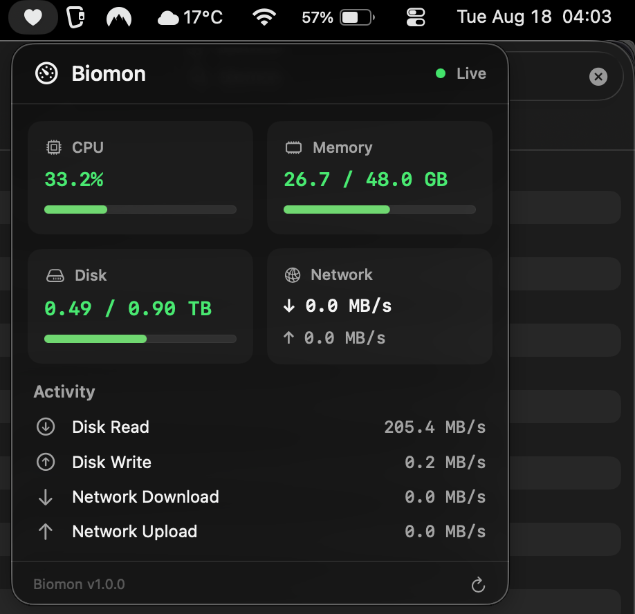

# Biomon


Biomon is a lightweight macOS application for monitoring and displaying system usage information.

## Compatibility

Biomon is compatible with both Apple Silicon & Intel.

## Installation

1. Download the latest `Biomon.app`.
2. Move `Biomon.app` to your `/Applications` folder.
3. Open Biomon.

If macOS prevents the application from opening, go to:

**System Settings → Privacy & Security → Open Anyway**

## Building from Source

### Requirements

- macOS
- Xcode

### Build

Clone the repository:

```bash
git clone https://github.com/ArjanDeo/Biomon.git
cd Biomon
open Biomon.xcodeproj
```
Build and run the project using Xcode.
